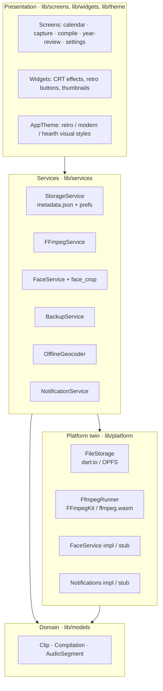
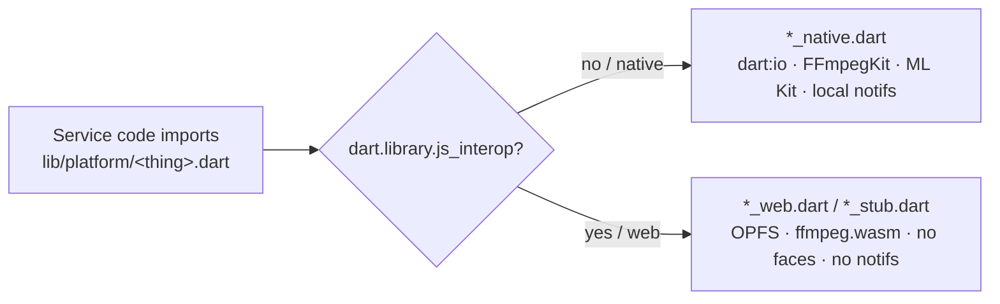
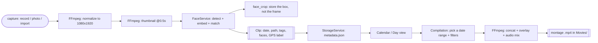
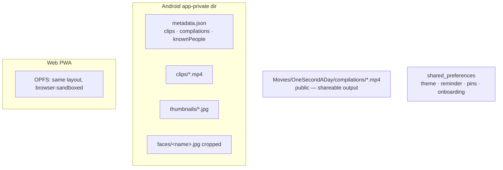

# Architecture Overview

> The one-page mental model of Punctum Temporis, then the diagrams that make it
> concrete. For *why* each load-bearing decision was made, see
> [`docs/adr/`](../adr/). For the exact pipelines, see
> [`reference/pipeline.md`](../reference/pipeline.md).

## What this is, in one paragraph

Punctum Temporis is a **local-first Flutter app**: a one-second-a-day video
journal. It is deliberately simple in its plumbing — no reactive state framework,
no database. A single **`StorageService`** is constructed at startup and injected
down the widget tree; it owns the in-memory clip map, persists it as one
**`metadata.json`** file, and reads/writes media through a **platform-twin file
layer** (`dart:io` on Android, the Origin Private File System on web). Everything
expensive — video processing, face detection, reverse-geocoding — lives behind a
service with a native and a web implementation chosen at compile time. All of it
runs on the device.

## The layers

Not canonical "Clean Architecture" (this app pre-dates that convention in the
fleet), but a clear four-layer separation. Higher layers depend downward only.

Read that and you understand 80% of the codebase: the UI never touches a plugin
directly; it goes through a service; a service that needs a platform capability
goes through a `lib/platform/*` twin.

## The platform twin (the one clever move)

The same Dart code ships as a native Android app and a web PWA. Native-only
plugins are swapped for web equivalents at **compile time** via conditional
exports — the app never branches on `kIsWeb` for these; it imports a name and the
build picks the implementation.

- **File storage** — `dart:io` filesystem on Android; the browser's **Origin
  Private File System (OPFS)** on web. Same async `FileStorage` surface.
- **FFmpeg** — `FFmpegKit` (native binary) on Android; **`ffmpeg.wasm`** on web.
- **Faces & notifications & home widget** — native implementations on Android;
  **stubs** on web (face recognition, push notifications, and the widget are
  disabled there by design). See [ADR-0002](../adr/0002-platform-twin.md).

## The core loop (capture → keep → compile)

Every feature hangs off one loop: turn a moment into a stored `Clip`, then turn a
range of clips into a `Compilation`.

Two facts to hold onto:

1. **Storage is a single JSON file, not a database.** `StorageService` keeps the
   whole clip map in memory and rewrites `metadata.json` on every mutation. Simple,
   trivially backup-able, no migrations — at the cost of whole-file writes and no
   queries. See [ADR-0003](../adr/0003-json-metadata-no-db.md).
2. **Faces never persist as whole frames.** Recognition runs on device; a saved
   reference image is cropped to the ML Kit bounding box before it is written. See
   [ADR-0004](../adr/0004-on-device-face-crop.md).

## Where data lives

- **App-private storage** holds the source clips, thumbnails, cropped face
  references, and the metadata index — not visible to other apps.
- **Public `Movies/`** holds only the *compiled* montages, so a finished film is
  easy to find and share.
- **`shared_preferences`** holds settings (theme mode, accent, visual style,
  reminder time, pinned tags/locations, onboarding flag, celebrated milestones).
- **Web** mirrors the app-private layout inside OPFS; downloads replace "save to
  Movies."

## Module map (where to look)

| Concern | Files |
|---|---|
| **Domain model** | `lib/models/clip.dart` (`Clip`, `Compilation`, `AudioSegment`, `ClipType`) |
| **Persistence / app state** | `lib/services/storage_service.dart`, `lib/utils/date_format_util.dart` |
| **Video (FFmpeg)** | `lib/services/ffmpeg_service.dart`, `lib/platform/ffmpeg_runner{,_native,_web}.dart` |
| **Faces** | `lib/platform/face_service{,_impl,_stub}.dart`, `lib/services/face_service.dart`, `lib/services/face_crop.dart` |
| **Backup / restore** | `lib/services/backup_service.dart` |
| **Location** | `lib/services/offline_geocoder.dart`, `lib/utils/location_util.dart` |
| **File storage twin** | `lib/platform/file_storage{,_native,_web}.dart` |
| **Notifications** | `lib/services/notification_service.dart`, `lib/platform/notification_service{,_impl,_stub}.dart` |
| **Screens** | `lib/screens/*` (calendar, capture, gallery/media import, clip preview, day view, compilation, year review, settings, backup/restore, onboarding) |
| **Widgets / theme** | `lib/widgets/crt_effects.dart`, `lib/widgets/*`, `lib/theme/app_theme.dart` |
| **App entry** | `lib/main.dart` |

## Invariants that must always hold

These are the rules the whole design depends on (enforced in tests and in code;
recorded as ADRs). Breaking one is a design regression, not a feature.

1. **Nothing leaves the device at runtime.** No network client sends user data.
   The only egress is a user-initiated share or backup export. ([ADR-0001](../adr/0001-local-first-no-accounts.md))
2. **One codebase, two platforms, via the twin.** A native-only capability gets a
   web twin or a stub — never a `kIsWeb` branch scattered through a service.
   ([ADR-0002](../adr/0002-platform-twin.md))
3. **Faces persist cropped, and inference is on device.** ([ADR-0004](../adr/0004-on-device-face-crop.md))
4. **Restored backups are untrusted input.** Zip-bomb, ZIP-Slip, and metadata
   path-traversal defenses stay intact. ([ADR-0005](../adr/0005-untrusted-backup-hardening.md))
5. **Media operations fail safe.** A decode/FFmpeg/model failure degrades (skip,
   fall back, return `null`) — it never crashes capture or loses a clip.
